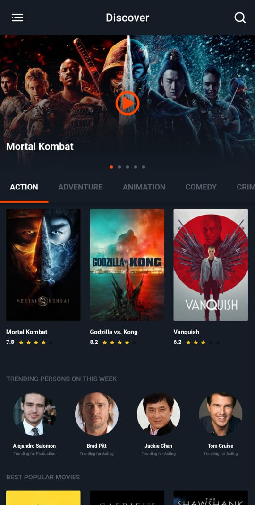

# flutter-movie

<table>
   <tr>
       <td></td>
       <td></td>
       <td></td>
     </tr>
 </table>
 
## API: [The Movie Database API](https://developers.themoviedb.org/3)

Used Package:
- equatable: ^2.0.0
- dio: ^4.0.0
- flutter_bloc: ^7.0.0
- bloc: ^7.0.0
- eva_icons_flutter: ^3.0.0
- font_awesome_flutter: ^9.0.0
- page_indicator: ^0.4.1
- flutter_rating_bar: ^4.0.0
- sliver_fab: "^1.0.0"
- youtube_player_flutter: ^8.0.0
- intl: ^0.17.0
- shimmer: ^2.0.0

[Download APK](https://github.com/rozakia-ch/flutter-movie/raw/main/apk/app-release.apk)
